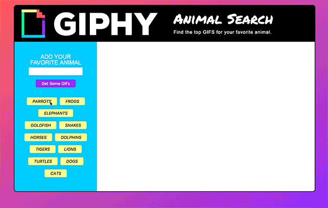

# GiphyAPI

## Overview
This app is built using the Giphy API.

When the User clicks on the button on the left, you will get 10 gifs featuring the animal you select.

If the user enters a new animal into the search field and clicks "get some gifs", a new button will be created and added to the list. The user can then click on the button and load the gifs for that animal.

When the gifs are loaded, they are loaded as static images and will animate only after the user clicks on them.

## Demos

## Languages/Resources Used
- HTML
- CSS
- Javascript
- jquery
- REST API
- Giphy API
